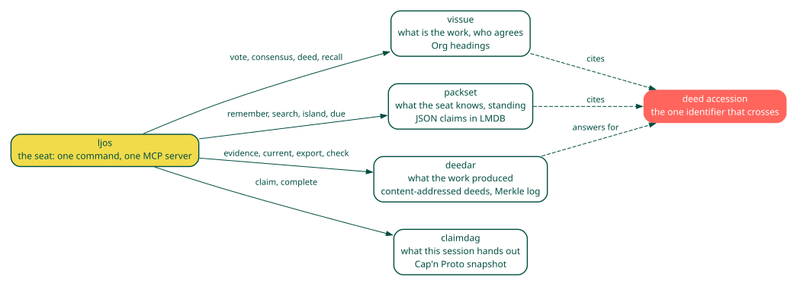
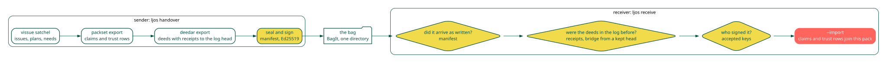

===========
Explanation
===========

Five habitats, one identifier
-----------------------------

Each habitat answers one question and is the authority for it. Cards
are read-only. A deed accession is the one identifier that crosses the
writable habitats: the tracker cites it on a node, the pack cites it
in a claim, the deed store answers for it. No habitat opens another's
format. The seat composes them by passing accessions on pipes, and
stays thin: its only state of its own is the mapping from tracker ids
to claim-graph nodes. Argv law sits beside them. It is not a sixth
store. ``ljos policy`` prints the line; ``ljos-policyd`` is the TCB when it is on ``PATH`` or ``POLICYD_BIN``.

The contracts
-------------

- Citation is not a merge. Citing a deed names it; the bytes stay in the
  deed store.

- Completing a session node does not close a ticket. The claim graph is
  session state; the tracker decides when work is done.

- Cards are read-only. The seat writes to the pack; a person writes the
  cards.

- The pack is written only by ``remember``, ``prefer``, ``trust``, ``learn``,
  ``graded``, ``forget`` and an imported handover. Nothing is extracted from a
  transcript.

- A tool that fails is a habitat refusing or down, and says which. It is
  never an empty answer.

Memory that grows, is reviewed, decays, and is retracted
--------------------------------------------------------

.. image:: _static/memory.svg

A claim enters the pack because the seat decided it was worth keeping, and
enters a review clock at the same moment. The clock is the spaced-repetition
model the Free Spaced Repetition Scheduler (FSRS) fits to review data (https://doi.org/10.1145/3534678.3539081): a stability in
days, a difficulty, and a due date; recalled grows stability by how overdue
the claim was, lapsed halves it. ``due`` is what the seat is about to forget.
When the pack's decay slot is on, the same retrievability
``R = (1 + 19/81 * t/S)^(-1/2)`` scales a search score, so an unreviewed
claim sinks without vanishing. The power-law form is the one Wixted and
Ebbesen measured (https://doi.org/10.1111/j.1467-9280.1991.tb00175.x); the spacing
effect it schedules for is reviewed by Cepeda et al.
(https://doi.org/10.1037/0033-2909.132.3.354). A claim shown wrong is retracted with
the deed that showed it, and a contrary claim closes the old one's window.
On a longitudinal corpus where one claim per topic is kept recalled and
three paraphrases written later are not, retrievability ranks the kept
claim first 0.947 of the time; lexical scoring lands at chance and a
recency half-life at 0.270 (the packset site carries the table).

Islands
-------

A task does not touch everything a seat knows. The pack links each claim to
the claims it shares names with, pruned so a neighbourhood spreads over the
directions a claim is about. Those links form natural clusters, and
``ljos island`` finds the one a task activates: the top search hits are the
seeds, activation spreads two hops along the links with half lost per hop
and divided by fan-out, and the cluster comes back strongest first. That is
spreading activation over a semantic network (Collins and Loftus,
https://doi.org/10.1037/0033-295X.82.6.407), not a persona: a persona is a view that
colours everything, an island is what this piece of work involves. The
pack can also list its islands outright, by label propagation over the link
graph (https://doi.org/10.1103/PhysRevE.76.036106).

Use shapes the graph. Every link carries a weight, 0.5 until something
fires over it. When the seat goes on to use an island, ``ljos island --fire``
says so, and the strongest eight fire together: each pair's weight moves a
tenth of the way to one, a pair with no link gains one, and every other link
of a fired claim loses two percent. Hebb's rule with Oja's forgetting term
(https://doi.org/10.1007/BF00275687), so weights stay bounded and paths a seat never
walks fade without being deleted. Activation spreads in proportion to
weight, so the next cue like this one walks a heavier path. The weights are
on the atom beside the links and travel in a handover.

Agreement that learns
---------------------

A tally counts, and a count is right only when every voter is worth the
same. The seat settles a vote with DeGroot's model
(https://doi.org/10.1080/01621459.1974.10480137), or Friedkin and Johnsen's anchored
version (https://doi.org/10.1080/0022250X.1990.9990069), over trust rows. The rows are
pack atoms, so they are memory: dated, supersedable, exportable. ``learn``
moves them by what turned out right, with the multiplicative update of
Hedge (https://doi.org/10.1006/jcss.1997.1504), so a voter who is repeatedly wrong
loses influence and one who is right keeps it. A person can also set a row
and cite the deed behind it.

Handover that can be checked
----------------------------

A handover is a BagIt bag with the tracker slice, the pack's atoms, and
the deeds both cite, each deed with its inclusion receipt against the log
head, the manifest signed when the sender has a key. The receiver checks
three things in order, each unanswered by the one before: the bag arrived
as written, the deeds were in the sender's log before the handover, and a
key the receiver accepts signed it. Only then are the atoms imported, trust
rows included. Learning travels with its evidence.

Model and runner agnostic, human readable
-----------------------------------------

Nothing in the seat calls a model. The stores are files a person can read:
Org headings, one JSON object a line, a content-addressed directory, a
Cap'n Proto snapshot. Any agent that can run a command or call a Model Context Protocol tool
can work the seat, and a person can do the same from a shell or an editor.
A read-only viewer over the habitats is the open work.
