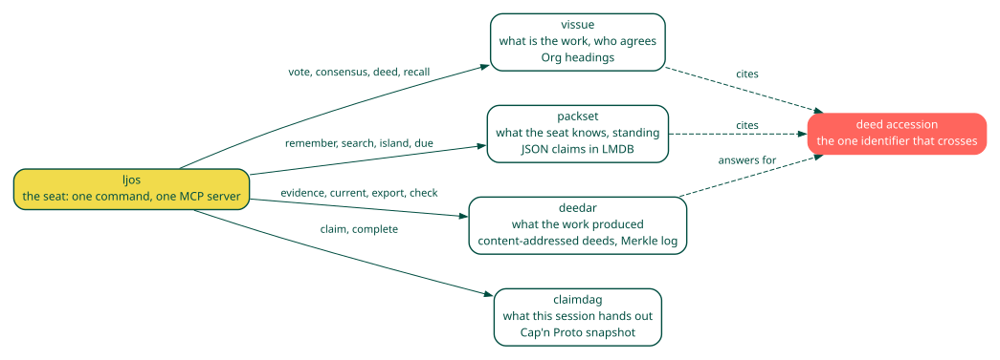
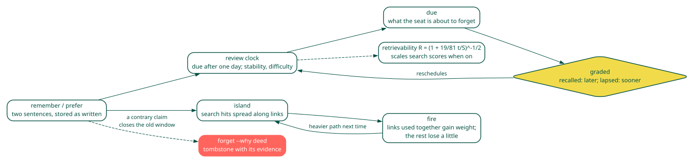
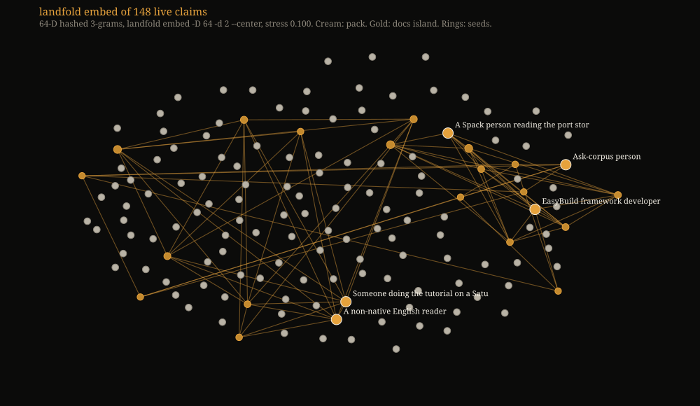

What each store keeps
=====================

|image1|

ljos keeps nothing of its own. Each kind of fact lives in one store, and
ljos calls that store's command line to read or write it.

====================== ======================================================== ============================================== ============================= ============================================================== ===========================
Store                  Keeps                                                    Lives                                          Lasts                         Written by                                                     Look at it
====================== ======================================================== ============================================== ============================= ============================================================== ===========================
tracker (vissue)       issues, notes, votes, the deeds an issue cites           org files in a git repository                  as long as the repository     ``ljos file``, ``note``, ``vote``, ``finish``                  ``vissue show ISSUE``
pack (packset)         memories: lessons, preferences, rules, personas, trust   the ``packsetd`` daemon's store                until superseded or forgotten ``ljos remember``, ``prefer``, ``accept``, ``rule``, ``learn`` ``ljos search WORDS``
deed store (deedar)    signed records of what a piece of work produced          a content-addressed directory                  permanent                     ``deedar create``                                              ``ljos evidence ACCESSION``
claim graph (claimdag) who is working on what right now, as a lease per sitting ``$XDG_RUNTIME_DIR/claimdag``, one per machine until reboot                  ``ljos sitting``, ``finish``, ``release``                      ``claimdag list --all``
consensus              the weighting that settles a vote                        computed from the tracker and the pack         nothing stored                ``ljos consensus``                                             ``ljos consensus ISSUE``
====================== ======================================================== ============================================== ============================= ============================================================== ===========================

The claim graph shows itself least, by design. It answers a question
that matters while work runs: is anyone already on this issue, here,
now? ``ljos sitting`` takes the issue's node before it returns. A second
sitting on the same issue from another conversation learns who has it.
``ljos finish`` marks the node done. The store sits in the runtime
directory, so a reboot clears it, and a lease never outlives its holder.
``ljos doctor`` shows its row, ``ljos seat`` names this conversation's
holder, and ``claimdag list`` shows every live claim.

A deed accession is the one identifier the writable stores share. The
tracker cites it on an issue and the pack cites it in a memory; the deed
store answers for it.

How a shell command is judged
=============================

Before an agent's shell command runs, the runner's hook hands it to
``ljos hook``, which asks four layers, in the order below. No later layer can allow
what an earlier one refused, so the first refusal wins.

-  **The seat guard.** It refuses a command that writes the seat's own
   files. Those are its binaries, its hook entries, ``~/.config/ljos`` and
   the approvals store. An agent cannot rewrite the law it runs under.
-  **ljos-policyd.** Each pipeline of the line goes to ``ljos-policyd`` as
   one call, in shell words. It refuses privilege runners and a
   download handed to a shell. It also refuses a recursive delete outside
   ``/tmp``, a setuid ``chmod``, raw-disk writes and a force push. ``ljos doctor``'s ``policy``
   row says whether it runs the table built into it or phronesis after
   that table. Without the binary nothing is refused here, unless
   ``POLICYD_REQUIRED`` is set to 1, which refuses everything instead.
-  **Seat rules.** ``ljos rule`` writes a rule (a pattern, and a verdict of
   deny or ask) into the pack, and the seat tries it against each command
   of the line. A quoted sentence or a heredoc body counts as data.
-  **The push check.** A ``git push`` is free to a repository the account
   owns alone and has never released; to any other it needs
   ``LJOS_CITE`` set to the issue that records the decision behind it.

An ``ask`` verdict is a question for the person. On Claude Code and Grok
Build it is the runner's own permission prompt. On a runner without one,
the hook prints a request id. The person calls ``ljos_request_approval``
with that id so the client shows a consent form, replies ``approve ID`` in
the same conversation, or runs ``ljos approve ID`` in a terminal. A runner's own
settings come first: a command its settings deny is refused before any
hook is asked.

``ljos policy -- COMMAND`` prints the combined answer for one command
without running it.

The contracts
=============

-  Citing a deed names it; the bytes stay in deedar.
-  A finish closes the sitting. The ticket closes only with ``ljos finish ISSUE --close``, when the work is accepted. The claim graph is
   session state; the tracker decides when work is done.
-  Cards are read-only. The seat writes to the pack; a person writes the
   cards.
-  The pack is written only by ``remember``, ``prefer``, ``trust``, ``learn``,
   ``graded``, ``forget`` and an imported handover. Nothing is extracted from a
   transcript.
-  A tool that fails is a habitat refusing or down, and says which. It is
   never an empty answer.

Memory that grows, is reviewed, decays, and is retracted
========================================================

|image2|

A claim enters the pack because the seat decided it was worth keeping, and
enters a review clock at the same moment. The clock is the spaced-repetition
model the Free Spaced Repetition Scheduler (FSRS) fits to review data (doi:10.1145/3534678.3539081): a stability in
days, a difficulty, and a due date; recalled grows stability by how overdue
the claim was, lapsed halves it. ``due`` is what the seat is about to forget.
When the pack's decay slot is on, the same retrievability
``R = (1 + 19/81 * t/S)^(-1/2)`` scales a search score, so an unreviewed
claim sinks without vanishing. The power-law form is the one Wixted and
Ebbesen measured (doi:10.1111/j.1467-9280.1991.tb00175.x); the spacing
effect it schedules for is reviewed by Cepeda et al.
(doi:10.1037/0033-2909.132.3.354). A claim shown wrong is retracted with
the deed that showed it, and a contrary claim closes the old one's window.
On a longitudinal corpus where one claim per topic is kept recalled and
three paraphrases written later are not, retrievability ranks the kept
claim first 0.947 of the time; lexical scoring scores at chance and a
recency half-life at 0.270 (the packset site carries the table).

When the seat speaks
====================

The hook speaks at a prompt, a failed tool and a stop, and fires its
memories before a compaction. A prompt gets what it activates: the
preferences and standing lessons that two scorers named and that share a
word with it. A claim reaches a session once between compactions. It
arrives when it first matters, not on every command after.

A runner that reports a failed tool, as Grok Build does with
``PostToolUseFailure``, gets a search of its own. The hook searches on the
command and its error and hands back up to three standing claims that
share two or more content words with them. A prompt needs only one.

A compaction drops what the seat handed the conversation. If two or more
memories were handed over, up to eight of them fire together before it.
Every memory handed over then leaves the session's record, so a later
prompt can bring it back. The next delivery names the issue the
conversation still has open and where its working set is. Claude Code hears
it as the session resumes, Grok Build and Cursor with the next tool
result.

The hook blocks a turn's stop once if the turn used tools, had no issue
and never touched the seat. A turn asked for a decision that cast no
ballot is held too. It also audits the turn when Jev is on.

Islands
=======

|image3|

A task does not touch everything a seat knows. The pack links each claim to
the claims it shares names with, pruned so a neighbourhood spreads over the
directions a claim is about. Those links form natural clusters, and
``ljos island`` finds the one a task activates: the top search hits are the
seeds, activation spreads two hops along the links with half lost per hop
and divided by fan-out, and the cluster comes back strongest first. That is
spreading activation over a semantic network (Collins and Loftus,
doi:10.1037/0033-295X.82.6.407), not a persona: a persona is a view that
colours everything, an island is what this piece of work involves. The
pack can also list its islands outright, by label propagation over the link
graph (doi:10.1103/PhysRevE.76.036106).

Use shapes the graph. Every link carries a weight, 0.5 until something
fires over it. When the seat goes on to use an island, ``ljos island --fire``
says so, and the strongest eight fire together: each pair's weight moves a
tenth of the way to one, a pair with no link gains one, and every other link
of a fired claim loses two percent. Hebb's rule with Oja's forgetting term
(doi:10.1007/BF00275687), so weights stay bounded and paths a seat never
walks fade without being deleted. The same eight fire at most once an hour.
Two seats or five personas closing sittings on one issue tighten its links
one step in total, not one step each. A persona fires through a lens: its
weights live beside the shared ones under its name and only it reads
them, so the facts stay one substrate and each persona's paths over them
are its own. Activation spreads in proportion to
weight, so the next cue like this one walks a heavier path. The weights are
on the atom beside the links and travel in a handover.

The island was measured as a ranking on LongMemEval and lost: sessions
linked to their five nearest by dense cosine, the fused top ten seeding
the same spreading activation the writer runs, hit@1 0.377 against the
fused panel's 0.889 over 470 questions, recall@10 unchanged at 0.981.
Activation flows to the well-connected claims. A hub is well connected,
and a question asks for something else. The negative fixes the island's place: what the
seat prints beside the hits at a sitting, for orientation, and what fires
together after use; never the order the hits come in.

Time as data
============

Every record in the seat is dated: an atom carries the writer's clock and,
when it was retired, the window it was live in; a deed carries the time it
was produced; the tracker's logbook carries the time of each note, state
change and claim. The seat hands that to the reader as data rather than as
timestamps to subtract. Every recalled memory, in the hook, a brief, ``ljos
search``, the island in ``ljos sitting``, carries its age in words (``today``,
``3 weeks ago``), and the hook's lessons run oldest to newest behind the
preferences, so a later lesson reads as a revision of an earlier one. ``ljos
timeline ISSUE`` merges the three stores into one dated list with the gap
between consecutive lines, and ``ljos search --as-of TIME`` asks the pack as
it was at an earlier time.

A habit is the same rule turned into a series. A number the seat keeps
measuring is written as a reading that supersedes the reading before it
and carries that reading as what it was, so the pack keeps one live value
a habit, an as-of search reads the value at any earlier time, and the
cadence is the reading's review clock: a week without a new reading and
the habit is due like any claim. The numbers in this document are
readings.

The design came out of measurement. On a public long-conversation
benchmark the seat's retrieval finds the right session at the top for nine
questions in ten, and the answers a small reader gives over those sessions
fall furthest on the questions about time: handed raw dates it did the
arithmetic itself and got a third of them. A reader is a poor calendar; a
store that already knows every date is a good one, so the store does the
arithmetic and the reader reads the order.

The field, and the seat's place in it
=====================================

Agent memory systems in the literature and on the market do one of a few
jobs, and the seat's design can be read against each.

Mem0 (doi:10.48550/arXiv.2504.19413) reads a conversation with a model,
extracts facts, and has the model decide for each whether to add, update,
delete or leave the store; a graph variant adds entity nodes. Zep
(doi:10.48550/arXiv.2501.13956) builds a temporal knowledge graph: a model
extracts entities and relations, each edge carries the time it became true
and the time it stopped being true beside the time it was written, and
retrieval is lexical, dense and graph search fused and reranked. MemGPT
(doi:10.48550/arXiv.2310.08560), now Letta, keeps a small core memory in
the model's context that the model edits with tools, a recall store of the
conversation and an archival vector store, and its sleep-time compute
(doi:10.48550/arXiv.2504.13171) reorganises memory between turns. A-MEM
(doi:10.48550/arXiv.2502.12110) keeps notes with model-written keywords
and links and rewrites older notes when a new one arrives. HippoRAG
(doi:10.48550/arXiv.2405.14831, doi:10.48550/arXiv.2502.14802) extracts a
knowledge graph and retrieves by personalised PageRank from the entities
a question names. MemoryBank (doi:10.48550/arXiv.2305.10250) forgets on an
Ebbinghaus curve refreshed by recall; Generative Agents
(doi:10.48550/arXiv.2304.03442) rank by recency, importance and relevance
and reflect. All of them put a model in the write path.

The seat does not. What is remembered is what was said with ``Remember`` or
``Prefer``, stored as written, so a transcript never becomes a belief by
being read; that is the privacy-of-write, and it is the one design choice
here that the others do not make. Forgetting is by review rather than by
age: retrievability from the clock of what was recalled and when, the
same schedule spaced repetition runs, where MemoryBank ages by time and
Generative Agents by recency. Time is data, as in Zep: a claim carries the
time it was written and the window it was live in, a later claim with the
same head closes the earlier one, and the pack can be asked as of any
time. Retrieval is a panel of scorers fused, as Zep fuses, and every hit
says how many scorers named it. The link graph is Hebbian: use strengthens
a link and disuse fades it, and the cluster a task activates is read
beside the hits for orientation, not in their place, because measured as
a ranking it lost. Above the pack the seat has what a memory alone does
not: ballots settled under trust rows that learn from outcomes, deeds
that record what the work produced, a claim graph for who has what,
and a signed handover another seat can check.

More agent memory systems came later in 2025, and none of them stores
only what was said. ReasoningBank
(doi:10.48550/arXiv.2509.25140) distills reasoning strategies from the
agent's own judged successes and failures and retrieves them on the next
task. Agentic Context Engineering (ACE)
(doi:10.48550/arXiv.2510.04618) keeps a playbook of itemised strategies that a reflector and a curator grow by small deltas, because
rewriting a context whole erodes it. In MemOS
(doi:10.48550/arXiv.2507.03724), memory is a resource with provenance,
versions and a lifecycle. MIRIX (doi:10.48550/arXiv.2507.07957) splits it
into six typed stores, each run by its own agent. Memory-R1 (doi:10.48550/arXiv.2508.19828)
trains its add, update and delete choices by reinforcement learning. The
runners grew memories of their own. In Grok Build, memory is a set of
Markdown topics per workspace; it captures observations after each turn
and folds them in with a ``/dream`` pass.

The pack already covers much of what these systems add. ACE's itemised
playbook, grown by deltas, is a pack of one-claim atoms superseded by head,
and MemOS's provenance and versions are an atom's writer, deeds and live
window. ReasoningBank's lessons from failure are ``finish --lesson``, and
the hook hands back what bears on a command when it fails. A claim enters
the pack when someone says to keep it with ``remember`` or ``prefer``, and
that write is origin ``user-declared``. ``finish --lesson`` and
``findings --remember`` file origin ``agent-derived`` as proposals. The
prompt hook files a correction as a proposal and does not write it.
``ljos accept`` writes a proposal, and so does the same text typed with
``remember`` or ``prefer``. An import from ``receive`` or ``sync`` is origin
``peer``. None of these paths reads a runner's own memory, so the seat
and that memory sit side by side without either writing the other.

What the others have that the seat does not: extraction. A model reading
a transcript finds facts nobody said ``Remember`` to, and on a benchmark of
chat logs that coverage is most of the score. The pack has a proposals
path for that, held so a proposal becomes a claim only on an explicit
accept, and it runs on a model the seat does not bundle. Measured on the
public benchmarks with one small reader, the seat's retrieval finds the
right session first nine times in ten on LongMemEval
(doi:10.48550/arXiv.2410.10813), answers within a few points of the
labelled-session ceiling where retrieval decides. On MemoryAgentBench
(doi:10.48550/arXiv.2507.05257), scored as its paper scores it (each
source on its own metric, then the mean of four), lexical retrieval with
that small reader answers 0.568 of the accurate-retrieval questions (95%
CI 0.530 to 0.605), below the published 0.605 for BM25 and 0.651 for
HippoRAG-v2 with a hosted GPT-4o-mini reader. On conflict resolution at
262K the replacement rule with fused retrieval reaches 0.395 (CI 0.350
to 0.440) against their 0.255 and 0.295. The readers differ, so neither
row is a like-for-like win. The compare page on the org site carries
these rows, and the reproduction package regenerates them.

Agreement that learns
=====================

A tally counts, and a count is right only when every voter is worth the
same. The seat settles a vote with DeGroot's model
(doi:10.1080/01621459.1974.10480137), or Friedkin and Johnsen's anchored
version (doi:10.1080/0022250X.1990.9990069), over trust rows. The rows are
pack atoms, so they are memory: dated, supersedable, exportable. ``learn``
moves them by what turned out right: each voter's record of outcomes that
agreed with its ballot and outcomes that did not, this one added, gives
its accuracy, and the rows are the log odds of that, so a voter is weighed
by what it got right rather than by how many times it was punished. The
multiplicative update of Hedge (doi:10.1006/jcss.1997.1504) is kept as
``--rule hedge``. The seat's own settle was run on voters of known accuracy (the
consensus crate's synthetic voters, nine voters, four hundred questions,
twenty seeds). There the record answers 0.929 of the questions, batch
calibration 0.934, the true weights 0.939, Hedge 0.831 and Hedge with a
fixed share of recovery 0.877; a count answers 0.820. A person can also
set a row and cite the deed behind it. When nobody names an outcome, ``calibrate``
estimates each voter's accuracy from the project's history (Dawid and
Skene, doi:10.2307/2346806) and writes the rows as the log odds of that
accuracy, the weight under which a weighted majority of independent
voters is the maximum-likelihood decision (Nitzan and Paroush,
doi:10.2307/2526438): nine right in ten outweighs six in ten by five to
one, and chance earns the floor.

A panel of subagents that each read the work and vote is the seat's form
of the parallel agents the products run (self-consistency,
doi:10.48550/arXiv.2203.11171; multi-agent debate,
doi:10.48550/arXiv.2305.14325; mixture of agents,
doi:10.48550/arXiv.2406.04692; the commercial heavy modes). Two things
differ. The personas are atoms in the pack, with an anchor the settle
honours (Friedkin and Johnsen; a captain that decides a split is a persona
at anchor zero), and the weights are memory that moves with outcomes and
history, scoped to the topics they were earned on. A panel seats only
the personas whose domains the issue speaks to, read from its title's
words and the entities of the island it activates; every persona sits
when none speaks to it, since a seat that runs every persona on every
issue is a count with extra steps. The ``run_a_panel``
prompt orders it: one subagent per persona, one ballot each as itself,
then the settle, then ``learn`` when the world answers. Chen et al.
(doi:10.48550/arXiv.2403.02419) show why a count does not improve with
more voices on hard items; a weighted settle is the alternative this seat
takes.

A settle is a weighted vote outside a ``broad`` issue: each voter's weight
is its social power. The iterate and exact engines print that power as
``influence``, beside the shares. They print the number of equal voices the
settle is worth as ``effective_voters``. A margin inside what the residual leaves
open is reported as a ``tie``. A voter weighs its own ballot as the others
weigh it, so with no voter anchored and no discount, the log-odds rows
``learn`` writes settle as the weighted vote they describe. One constant
self-weight for everyone had flattened them toward a count. A weak crowd
could outvote its best voter.

Personas that run on one model share its mistakes, which is why ``learn``
keeps the option each issue closed on. ``consensus`` asks the consensus
crate's ``correlation`` who errs with whom once five issues have one. It
then discounts each correlated cluster; exact clones count once if their record
has a hit and a miss. A pair counts only when its correlation passes a
test of independence, so a short history does not discount a voter by
noise. The consensus crate's ``derive/`` checks the settle and that test.

A short record misleads the weights too: plug-in log odds drop a good
voter who started unlucky, and lose to a plain count by 6.4 points on a
panel of seven similar voters at three outcomes. ``learn`` therefore shrinks
each voter's accuracy toward the panel's pooled accuracy before weighing
it, by empirical Bayes (Efron and Morris,
doi:10.1080/01621459.1975.10479864). The first outcome leaves the voters
alike, and a long record keeps the differences it shows.

Each voter's ballot follows its own reading of the evidence. The brief carries no
other ballot and tells the persona to cast before it reads a tally,
since a ballot cast after the others adds a voice and no evidence.

Judgment, and where a judge slots in
====================================

The seat has always made judgments at four points. Each had a local
answer, and each answer fed a structure that was already there.

=========== ================================================== ================================================================ ===============================================
point       the judgment                                       the local answer                                                 what consumes it
=========== ================================================== ================================================================ ===============================================
prompt hook which claims bear on the prompt                    two scorers agree, a score floor, a shared word, a cross-encoder the injected context
prompt hook is this a correction, or a choice put to the agent two phrase lists                                                 a proposal, then the nudges
panel       which option a persona votes for                   one subagent per persona                                         the settle, forecasts, ``learn``, ``calibrate``
stop        may the agent stop                                 rules on the held issue                                          one more round, once
=========== ================================================== ================================================================ ===============================================

Jev, TypeSafe's decision model, answers the same questions with a
probability and writes no text. So it replaces the answer at each point
and leaves the structure alone. Jev takes the same candidates and returns the
same context and nudges, and the local answer stays as the fallback.
A machine without ``jev.toml`` runs exactly as before.

The ballot shows the fit best. A ballot always carried a confidence, and
``predict`` always took a share per option, because the settle and the
reading that compares each share with its forecast need both. A subagent had to be told to guess
them. Jev returns them. The ballot is recorded as ``judge:MODEL``, and the
chosen option's probability is its confidence. The forecast is the judge's
prediction, and ``consensus`` does not read it. ``learn`` updates that
judge's trust row, which makes Jev's calibration on this seat's
questions a measurement. ``ljos judge-score`` is what reads the log.

Jev's ``confidence`` is ``(K·p_max − 1)/(K − 1)`` on every backend, so a stated
number is not a different cut. It decides whether to escalate. Personas
answered by one model are one voter, which is the point Chen et al. make
about counting more voices. A panel through Jev therefore casts one ballot
when every seat is sure and all agree, where the outcome could not move.
A split or unsure panel goes to subagents, and the metered model spends
only on the contested question. That is a cascade in the sense of
FrugalGPT (doi:10.48550/arXiv.2305.05176): the cheap judge first, the
expensive one on what it cannot settle.

The stop audit is the fourth point grown a judge. Whether a test ran is
read from the commands, in code. Jev answers whether the last message
claims done and whether the last run is red. A stop waits for another
round only on 0.9 for the first and 0.1 for the second. The review route
is the fifth: ``ljos due --judge`` names a claim the judges still find true, and
``ljos graded`` is what marks it recalled.

The cuts are fixed from TypeSafe's cookbooks. Every answer goes to
``jev-log.jsonl`` with the claim ids, a hash of the prompt, the latency,
and whether the call timed out or failed. The log does not keep the
prompt. ``ljos judge-score`` joins a ballot with the outcome it was about.
Nothing here trains on Jev's answers.

Handover that can be checked
============================

|image4|

A handover is a BagIt bag with the tracker slice, the pack's atoms, and
the deeds both cite, each deed with its inclusion receipt against the log
head, the manifest signed when the sender has a key. The receiver checks
three things in order, each unanswered by the one before: the bag arrived
as written, the deeds were in the sender's log before the handover, and a
key the receiver accepts signed it. Only then are the atoms imported, trust
rows included. Learning travels with its evidence.

Model and runner agnostic, human readable
=========================================

The seat runs without a model unless ``jev.toml`` enables Jev, an opt-in call
that judges a few questions. The stores are files a person can read:
Org headings, one JSON object a line, a content-addressed directory, a
Cap'n Proto snapshot. Any agent that can run a command or call a Model Context Protocol tool
can work the seat, and a person can do the same from a shell or an editor.
``ljos hud`` is the read-only viewer over due claims, held claims and trust.

The seat does not know the runners. It knows one thing every runner
does: it connects, and says its name. ``ljos-mcp`` takes that name at
initialize as the seat, and leaves a record under the runtime directory
keyed by the runner's process; ``ljos`` in a shell walks its own process
tree to that record, or to the first ancestor that is not a shell, and so
names the same seat. A runner's tools and its verbs are one seat with
nothing set, and a new runner needs no table anywhere. Memory, ballots
and trust accrue to the seat across conversations; claims are held by
the seat tagged with the conversation's process, so two conversations of
one runner hold two tickets. ``LJOS_SEAT`` overrides that name, and nothing needs it set.

Persona panes open in tools declared in ``[[tool]]`` tables, beside the
runners' ``[[harness]]`` tables. A persona that reasons in a session of its
own opens in the first tool that answers: the runners file's ``[[tool]]``
tables first, then herdr through its workspace and agent commands when
its server is up, then tmux. Every verb but ``pane_pointer`` is an argv or
a list of argvs, so a tool the seat has not met is one more table. A tool
that refuses is named in its own words, and the next one is tried. Half
the herdr calls the seat used to make had gone stale against herdr's
command line, ``agent start`` among them. A quiet fallback to tmux hid it.

The pane resumes a runner that exits non-zero, at most three times a
minute, and leaves a clean exit alone, as an Open Telecom Platform (OTP)
supervisor treats a transient child. Three of five personas on a panel chose the tool adapters
over fixing the herdr calls in place (``examples/runtime-panel``), and none
chose a Go rewrite or OTP-style supervision, in Rust or on the BEAM. Both
would start the same operating-system processes. Speed is no reason to
rewrite the seat: the shell check answers in under ten milliseconds.

The agent is told how, in one text. The protocol ``ljos protocol`` prints is
the same text ``ljos onboard`` installs as a skill and the server serves at
``ljos://protocol``: which store answers which question, the order of verbs
in a sitting, and the refusals. An agent that misuses the seat has, in
every case seen so far, not been handed that text: it asked the pack for
a deed, claimed with a hex id, or read a failure as an empty answer. Each
tool description opens with when to call that tool, so an agent that
skipped the protocol still meets the order.

.. |image4| image:: _static/handover.svg
   :width: 100.0%
